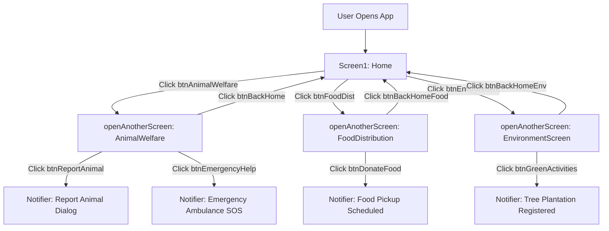

# CareConnect — MIT App Inventor 2 Project & Architecture Guide

**CareConnect** is a 3-screen community welfare mobile application designed for **MIT App Inventor 2**, built to facilitate **Animal Welfare**, **Food Distribution**, and **Environmental Protection**.

---

## 📱 Project Summary & Specifications

| Property | Value |
| :--- | :--- |
| **App Name** | **CareConnect** |
| **Package Name** | `appinventor.ai_rudhra0925.CareConnect` |
| **Primary Theme Colors** | Pine Green (`#1B4332`), Mint (`#52B788`), Deep Gold (`#E0A96D`), Royal Blue (`#1E40AF`) |
| **Target Framework** | MIT App Inventor 2 (AIA / APK) |
| **Key Components** | `VerticalScrollArrangement`, `HorizontalArrangement`, `Button`, `Image`, `Label`, `Notifier`, `TinyDB` |
| **Project File** | `CareConnect.aia` (Direct Download Available) |
| **Live Simulator** | `https://rudhra0925-wq.github.io/careconnect.html` |

---

## 🏗️ Screen Architecture & Layout Hierarchy

### Screen 1: `Screen1` (Home)
- **Top Header (`HeaderBar`)**:
  - `lblAppTitle`: "CareConnect" (Bold, 20sp, White)
  - `lblAppSubtitle`: "Small actions. A bigger impact." (11sp, Mint)
- **Content (`ScrollContainer`)**:
  - `imgHeroBanner`: Displays `banner_home.jpg` (*"Together for a kinder world"*)
  - `btnAnimalWelfare`: Large Card Button (`#12261D`) navigating to `AnimalWelfare`
  - `btnFoodDist`: Large Card Button (`#12261D`) navigating to `FoodDistribution`
  - `btnEnvironment`: Large Card Button (`#12261D`) navigating to `EnvironmentScreen`
- **Bottom Navigation (`BottomNavBar`)**:
  - `btnNavHome` (🏠 Active), `btnNavActivity` (🤍 Activity), `btnNavProfile` (👤 Profile)
- **Non-Visible Components**:
  - `Notifier1`: Alerts and confirmation dialogs
  - `TinyDB1`: Local device key-value data storage

---

### Screen 2: `AnimalWelfare` (Animal Welfare)
- **Top Header (`HeaderBar`)**:
  - `btnBackHome`: Left Arrow Button `←` calling `closeScreen`
  - `lblTitle`: "Animal Welfare 🐾"
- **Content (`ScrollContainer`)**:
  - `imgHeroAnimal`: Displays `banner_animal.jpg` (*"Help • Protect • Adopt"*)
  - `btnReportAnimal`: *"📢 Report an Animal — Found an injured or stray animal? Let us know. >"*
  - `btnDonateAnimals`: *"💚 Donate for Animals — Support with food, medicine or funds. >"*
  - `btnAdoption`: *"🏠 Adoption — Give a loving home. >"*
  - `btnVolunteerAnimals`: *"👥 Volunteer — Be a part of the change. >"*
  - `btnEmergencyHelp`: *"🚨 Emergency Help — Need urgent assistance? Contact us. >"* (`#780000`)
- **Non-Visible Components**:
  - `NotifierAnimal`: Displays rescue submission alerts & 24/7 hotline dialogs

---

### Screen 3: `FoodDistribution` (Food Distribution)
- **Top Header (`HeaderBar`)**:
  - `btnBackHomeFood`: Left Arrow Button `←` calling `closeScreen`
  - `lblTitleFood`: "Food Distribution 🥣" (Royal Blue Theme `#1E40AF`)
- **Content (`ScrollContainerFood`)**:
  - `imgHeroFood`: Displays `banner_food.jpg` (*"Good Food Brings People Together ❤️"*)
  - `btnDonateFood`: *"🍱 Donate Food — Share surplus food with those in need. >"*
  - `btnRequestFood`: *"🤲 Request Food — Get food support when you need it. >"*
  - `btnDonationHistory`: *"📜 Food Donation History — View your past donations. >"*
  - `btnVolunteerFood`: *"👥 Volunteer — Join us in food distribution activities. >"*
  - `btnFoodWasteReport`: *"🗑️ Food Wastage Report — Report food waste in your area. >"*
- **Non-Visible Components**:
  - `NotifierFood`: Schedules volunteer food pickup confirmations

---

### Screen 4: `EnvironmentScreen` (Environment)
- **Top Header (`HeaderBar`)**:
  - `btnBackHomeEnv`: Left Arrow Button `←`
  - `lblTitleEnv`: "Environment 🌱" (Forest Green Theme `#2D6A4F`)
- **Content (`ScrollContainerEnv`)**:
  - `imgHeroEnv`: Displays `banner_environment.jpg` (*"Clean • Green • Sustainable 🌿"*)
  - `btnEnvReport`: *"⚠️ Environmental Report — Report illegal dumping or tree cutting. >"*
  - `btnGreenActivities`: *"🌳 Cleanup & Green Activities — Join tree planting & park drives. >"*
  - `btnPlantTree`: *"🌿 Adopt a Sapling / Donate — Fund urban greening. >"*
  - `btnEcoVolunteer`: *"👥 Eco-Volunteer Corps — Lead neighborhood zero-waste drives. >"*
- **Non-Visible Components**:
  - `NotifierEnv`: Event registration notifications

---

## 🧩 Visual Blockly Logic Flow

---

## 🚀 How to Import and Build in MIT App Inventor 2

1. **Visit MIT App Inventor:**
   Go to [http://ai2.appinventor.mit.edu/](http://ai2.appinventor.mit.edu/) and sign in with your Google account.

2. **Import the Project:**
   - In the top menu bar, click on **Projects** → **Import project (.aia) from my computer...**
   - Choose the file [`CareConnect.aia`](file:///C:/Users/AL%20FARES/.gemini/antigravity-ide/scratch/portfolio-rithika/CareConnect.aia).
   - The complete project with all 4 screens and assets will open automatically.

3. **Live Testing on Phone (MIT AI2 Companion):**
   - Download the free **MIT AI2 Companion** app from the Google Play Store on your Android phone.
   - On the web editor, click **Connect** → **AI Companion**.
   - Scan the 6-character QR code with your phone to test the app live in real time!

4. **Building the Android APK (`.apk`):**
   - On the web editor, click **Build** → **Android App (.apk)**.
   - Wait ~60 seconds for the cloud compiler to generate the barcode and download link for your standalone installable Android application!
